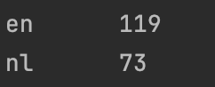

# Opdracht: Letterfrequenties
> Recognize Whether The Sentence Is English Or Dutch With An Accuracy Score Of At Least 90%

## Usage Command

OS X & Linux:

```sh
cat testtext.txt | hadopy --mapper "python mapper1.py" --reducer "python reducer1.py" | hadopy --mapper "python mapper2.py" --reducer "python reducer2.py"
```

Windows:

```sh
type testtext.txt | hadopy --mapper "python mapper1.py" --reducer "python reducer1.py" | hadopy --mapper "python mapper2.py" --reducer "python reducer2.py"
```

## Usage example
To use it:
- Download the entire code as ZIP or clone it
- Put your text file in it (I use [testtext.txt](https://github.com/DragonKiller952/DIP/blob/master/letterfrequentie%20MapReduce/testtext.txt))
- Use the Usage command For your OS system
  
This will give the amount of counted English and Dutch Sentences  

testtext contains 73 Dutch and 119 Engels Sentences.
Running this will give the following output:  


## Library Install

OS X & Linux:
```sh
pip3 install sys
pip3 install hadopy
```

Windows:
```sh
pip install sys
pip install hadopy
```

## Code Buddy
Ruben van Raaij:
[https://github.com/GameModes](https://github.com/GameModes)


## Code Explaination
4 files are used in the following order:
mapper1.py -> reducer1.py -> mapper2.py -> reducer2.py
### mapper1.py
- Reads text file with sys.stdin
- Splits it into sentences
- Replaces punction marks with '$' symbol, and makes all letters lower-case
- Splits it into Bigram ***( test -> te, es, st )***
- Adds a value to the Bigram ***( te, es, st -> (te, 1), (es, 1), (st, 1) )***
- Prints the Bigrams

### reducer1.py
- Reads print from mapper1.py with sys.stdin
- Splits it into Bigrams per sentence
- Create an empty matrix containg all possible characters ***( {a{a:0, b:0, c:0, etc..}, b{a:0, b:0, c:0, etc..}, c{a:0, b:0, c:0, etc..}, etc...} )***
- Adds the value of the bigram to the matrix using the bigram as keys
- Converts the values in the matrix to percentages ***( a{a:10, b:5, c:5} -> a{a:50, b:25, c:25} )***
- Prints the matrices

### mapper2.py
- Reads print from reducer1.py with sys.stdin
- Splits it into sentences
- Uses internally trained matrices to check which language the matrix looks more like by scoring each cell ***( The matrices are the result of the entext.txt and nltext.txt files passed through mapper1.py and reducer1.py while formatted as a single sentence )***
- Compares the two scores, and gives the string output "nl" or "en" with a value ***( (nl, 1) )*** based on which score is higher
- Prints the scores

### reducer2.py
- Reads print from mapper2.py with sys.stdin
- counts every output given by mapper2.py
- prints for every unique string, the amount of occurences it has been given by mapper2.py
